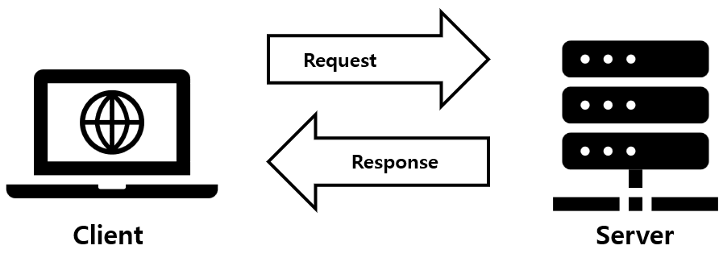

## Description
> The purpose of this project is to code a small data exchange program using UNIX signals.

</img>
#### Client (서비스를 요청)
클라이언트란, 서버에게 서비스를 요구하는 사용자나 컴퓨터이다.
웹 브라우저는 클라이언트에서 동작하며, 웹 브라우저인 크롬, 파이어폭스, 익스플로러를 웹 클라이언트라고한다.
+ 서버와 이어진 모든 단말기(컴퓨터의 경우는 Wi-Fi에, 모바일은 모바일 네트워크에 연결)와 웹에 접근하는 소프트웨어를 지칭한다.
+ 주로 사용자의 입력을 처리하며, 이를 서버에 요청한다.
> 화면에 보이고 사용자와 상호작용을 하는 브라우저(애플리케이션)

#### Server(서비스를 제공)
서버란, 서버 프로그램이 실행되고 있는 하드웨어이다. 웹서버는 서버에서 동작한다.
+ 클라이언트의 요청을 받아서 처리하고, 이를 다시 클라이언트에 응답한다.
+ 어떤 형태로든 클라이언트의 요청을 받아 정보를 제공하면 서버 컴퓨터가 될 수 있다.(노트북 등)
> 클라이언트에서 필요한 데이터를 요청하면 최종적으로 도달하는 추상적인 공간

#### 클라이언트와 서버의 통신
+ 일반적으로 네트워크 서비스를 받기위해 클라이언트가 통신을 시작한다. 클라이언트는 서버에 접속을 시도하고 그 연결 결과를 기다리거나, 어떤 서비스를 요구하고 응답을 기다린다. 클라이언트의 이와같은 요구에 대하여 서버가 응답을 보내는 방식으로 동작이 이루어진다.
+ 클라이언트와 서버의 통신방식
  + Polling방식
      + 클라이언트가 서버에 주기적으로 요청 후 응답을 받는 방식
      + 클라이언트가 주기적으로 요청과 응답후에는 연결이 끊어지기 때문에 요청 할 때마다 연결을 맺는 과정이 필요해 많은 비용이 소모 될 수 있다.
  + Long poll방식
    + 클라이언트가 서버에 대한 요청을 유지하며 반복적인 요청을 없애고 유효한 이벤트가 발생하면 응답을 해주는 방식이다.
    + Polling처럼 불필요한 요청에 계속 응답하는 것이 아니기 때문에 요청에 따른 커넥션 과정에서 비용이 절감됨
    + 하지만, 클라이언트의 수가 증가하면 그에 따른 응답을 해야하는 수도 증가하기 때문에 큰 차이는 없다
  + WebSokket 방식
    + 웹 소켓은 HTML5 표준 기술로, Clien와 서버가 연결된 후 부터 HTTP요청, 응답과는 관계없이 서버와 양방향 통신이 가능하다.
    + 채팅, 게인, 실시간 주식차트와 같은 실시간이 요구되는 응용프로그램 개발에 사용가능하다.
</img>
